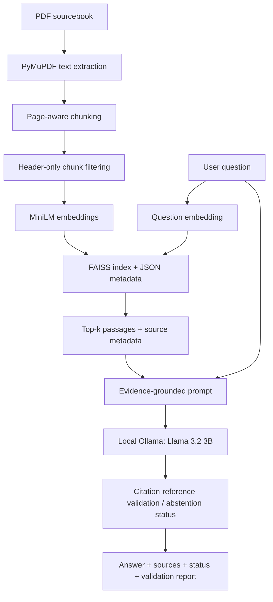

# Industrial Knowledge-Base RAG Assistant

A local-first Retrieval-Augmented Generation (RAG) application for asking natural-language questions about industrial technical documentation. It extracts text from a PDF, retrieves relevant passages with Sentence Transformers and FAISS, generates answers using a local Ollama model, and reports source citations and citation-reference validation through a CLI and FastAPI.

**Current scope:** A working, single-document prototype using a publicly available industrial motor sourcebook. This is a portfolio project, not a production-validated technical decision system.

## Features

- **Document ingestion:** Extract text from text-based PDFs using PyMuPDF; retain source filename and PDF page number.
- **Page-aware chunking:** Split each page into 120-word chunks with 25-word overlap and retain chunk IDs.
- **Targeted preprocessing:** Remove identified standalone page-header chunks before indexing.
- **Semantic retrieval:** Generate normalized `all-MiniLM-L6-v2` embeddings and search a persistent FAISS `IndexFlatIP` index.
- **Document-grounded generation:** Build an evidence-only prompt and use `llama3.2:3b` through local Ollama. A separate OpenAI client is implemented but **not required** for local use.
- **Traceability:** Return retrieved passages, scores, source filenames, page numbers, and bracketed source citations.
- **Citation-reference checks:** Detect citations to source/page pairs that were not retrieved and flag missing or malformed bracketed citations. Explicit insufficient-evidence responses are marked as abstentions.
- **Interfaces and tests:** CLI, FastAPI `/health` and `/ask` endpoints, legacy and expanded development-set retrieval evaluation, and automated pytest tests.
- **Evaluation dataset checks:** Validate question schema and relevance labels; distinguish answerable from unanswerable questions; require an explicit confirmation flag before running an eventual untouched final-test set.

## Architecture



Index construction is separate from querying. The FastAPI application lazily loads and caches the saved FAISS index and embedding model when `/ask` is first called. The `/health` endpoint checks API liveness, not index or Ollama readiness.

## Tech stack

| Component | Technology |
| --- | --- |
| Language / API | Python 3.11, FastAPI, Pydantic |
| PDF extraction | PyMuPDF |
| Embeddings | Sentence Transformers, `all-MiniLM-L6-v2` (384 dimensions) |
| Vector search | FAISS `IndexFlatIP` with L2-normalized vectors (cosine similarity) |
| Local answer generation | Ollama, `llama3.2:3b` |
| Optional cloud client | OpenAI (not used in the local workflow) |
| Testing | pytest, FastAPI TestClient / HTTPX |

## Quick start: Windows PowerShell

**Prerequisites:** Git, Conda with Python 3.11, and [Ollama for Windows](https://ollama.com/download/windows). An internet connection is needed for the initial Python dependency, embedding-model, and Ollama-model downloads. Local inference does not require OpenAI credits.

### 1. Clone and install

```powershell
git clone https://github.com/CodeByHer0407/industrial-knowledge-rag.git
cd industrial-knowledge-rag
conda create -n industrial-rag python=3.11 -y
conda activate industrial-rag
python -m pip install -r requirements.txt
```

### 2. Obtain the sample PDF

This project uses the U.S. Department of Energy sourcebook **Improving Motor and Drive System Performance**:

https://www.energy.gov/sites/prod/files/2014/04/f15/amo_motors_sourcebook_web.pdf

Create the input directory, download the PDF from the source above, and save it with this exact name:

```powershell
New-Item -ItemType Directory -Force data/raw
# Save the downloaded PDF as: data/raw/motor_manual.pdf
```

The PDF and generated index are deliberately excluded from Git; they are not bundled with the repository. Check the source's terms before redistributing its content.

### 3. Build the FAISS index

```powershell
python -m scripts.build_index
```

This extracts pages, makes overlapping chunks, filters identified header-only chunks, embeds the remaining text, and saves `data/index/index.faiss` and `data/index/metadata.json`. In the documented sample run, 528 generated chunks were reduced to **524 indexed chunks** after removing four header-only chunks. If you change the document or indexing configuration, rebuild the index.

### 4. Download the local generation model

```powershell
ollama run llama3.2:3b
```

The first run downloads the model; enter `/bye` to exit its chat. Keep the Ollama service running when you use the application. On Windows, the Ollama app normally manages the local server; if the app is not running, start it before making requests.

### 5. Ask a question locally

```powershell
# Retrieval + prompt preview; no LLM call:
python -m scripts.ask "How can motor efficiency be improved?"

# Full local RAG answer (no paid API):
python -m scripts.ask "What happens when a motor operates below 40% of full load?" --provider ollama --live

# See the exact retrieved prompt:
python -m scripts.preview_rag_prompt "How can motor efficiency be improved?"
```

The CLI displays retrieved source pages and similarity scores. In live mode, it also prints the generated answer and citation-reference validation. A valid citation reference **does not prove** that the cited text supports every claim.

### 6. Run the API

```powershell
python -m uvicorn app.main:app --host 127.0.0.1 --port 8000 --reload
```

Open [http://127.0.0.1:8000/docs](http://127.0.0.1:8000/docs) for the interactive API documentation. For example, send this JSON body to `POST /ask`:

```json
{
  "question": "What happens when a motor operates below 40% of full load?",
  "top_k": 5
}
```

The response contains `question`, `answer`, `sources`, `answer_status` (`answered`, `abstained`, or `no_context`), and `citation_validation` (a report or `null` when not applicable). `GET /health` checks whether the API is responding. The current `/ask` implementation uses local Ollama; it does not call OpenAI.

## Evaluation

The evaluation workflow retains the original 10-question baseline in `eval/questions.json` and maintains an expanded, manually curated development dataset in `eval/dev_questions.json`. The dataset loader in `app/eval_dataset.py` validates required fields, unique IDs, source/page labels, and answerability rules. `scripts/evaluate_retrieval.py` supports `--dataset legacy`, `--dataset dev` (the default), and `--dataset test`. Final-test evaluation requires `--confirm-final` and should be run only after the retrieval configuration is frozen; the final-test dataset is **not yet prepared**.

```powershell
# Reproduce the original 10-question baseline:
python -m scripts.evaluate_retrieval --dataset legacy

# Evaluate the expanded development set:
python -m scripts.evaluate_retrieval --dataset dev

# Run the automated test suite:
python -m pytest -q
```

### Historical 10-question baseline

| Retrieval metric | Original index (528 chunks) | Filtered index (524 chunks) |
| --- | ---: | ---: |
| Hit Rate@5 | 1.000 | 1.000 |
| Labeled Recall@5 | 0.850 | 0.850 |
| MRR@5 | 0.750 | 0.775 |

### Evaluation v2 — Milestone 1 (September 2026)

The expanded development set contains **17 questions: 16 answerable and 1 intentionally unanswerable**, using the saved 524-chunk index. An initial relevance-label audit added evidence for Q010 and Q016 and reviewed other high-ranking candidate passages. The original legacy baseline is preserved separately.

| Metric | Expanded development set |
| --- | ---: |
| Answerable questions scored | 16 |
| Unanswerable questions excluded from positive retrieval metrics | 1 |
| Hit Rate@5 | 0.9375 |
| Labeled Recall@5 | 0.8229 |
| MRR@5 | 0.7969 |

**Known failure:** Q013, a multipart question about VFD effects on pump flow/power and high static head, did not retrieve its currently labeled passage within the top five. Other top-ranked passages discuss related VFD concepts. This case is retained for later relevance review and retrieval experiments rather than relabeled simply to improve the score.

These are **small, development-set diagnostics—not estimates of general retrieval accuracy**. Questions and relevance labels were developed with reference to the indexed document; relevant passages may remain unlabeled. The unanswerable question is excluded from these positive retrieval metrics; adding an unanswerable question does **not** establish abstention performance. Broader curated coverage, a separate untouched final-test set, and systematic answer-level correctness, citation support, and abstention evaluation are still planned.

### Evaluation v2 — Milestone 2: Expanded Development Benchmark (September 2026)

The development dataset has been expanded to **42 manually curated questions:
35 answerable and 7 intentionally unanswerable**, covering motor
characteristics, pumping and fan systems, electrical safety, motor
maintenance, power quality, economics, and diagnostic methods.

The current evaluation uses the saved FAISS index containing **524 chunks**.
Positive retrieval metrics are calculated using the 35 answerable
questions. Unanswerable questions are reserved for answer-level
abstention evaluation.

| Retrieval metric | 42-question development set |
| --- | ---: |
| Answerable questions scored | 35 |
| Unanswerable questions excluded | 7 |
| Hit Rate@5 | 0.9429 |
| Labeled Recall@5 | 0.8619 |
| MRR@5 | 0.8081 |

**Known retrieval limitations:**

- **Q013:** The labeled VFD passage is missing from the top five, although
  multiple retrieved passages collectively provide relevant evidence.
- **Q024:** The annual maintenance activities occur in a chunk that is
  not retrieved. An earlier portion of the same inspection table is
  returned instead, illustrating a chunk-boundary limitation.

These are development-set diagnostics, not estimates of general
retrieval accuracy. The dataset was curated using the indexed source,
and relevance labels may remain incomplete.

The next evaluation milestone is an independent, held-out
18-question test set. It will remain unused during retrieval tuning
and will be evaluated after the retrieval configuration is frozen.

Initial manually inspected answer-generation examples are documented in [`eval/answer_evaluation.md`](eval/answer_evaluation.md):

| Example | Observation |
| --- | --- |
| Improving motor efficiency | Cited a retrieved page but overgeneralized qualified statements about motor design and enclosure. |
| Operating below 40% full load | Answer about low efficiency and poor power factor was supported by a retrieved passage on PDF page 27. |
| Facility Wi-Fi password | Abstained with an insufficient-documentation response instead of inventing a password. |

These three examples illustrate behavior; they do not establish an answer-accuracy or abstention percentage.


### Evaluation v2 — Milestone 3: Held-Out Test Dataset

A separate held-out test dataset has been created and schema-validated.

| Dataset | Answerable | Unanswerable | Total |
| --- | ---: | ---: | ---: |
| Development | 35 | 7 | 42 |
| Held-out test | 15 | 3 | 18 |
| Total | 50 | 10 | 60 |

The held-out test dataset includes manually identified evidence chunks
and reference answers for answerable questions. Its SHA-256 checksum
is recorded in `eval/test_questions.sha256`.

The test set is reserved for evaluation after the retrieval configuration
is frozen. It has not been used for retrieval tuning, and no test-set
retrieval scores are reported at this stage.

The development and test datasets use the same source document.
The test set measures performance on held-out questions, not
generalization to unseen documents.

### Answer-Level Evaluation — Development Set

Evaluated local Llama 3.2 3B responses on 42 development questions
using top-5 FAISS retrieval from a 524-chunk index.

| Metric | Result |
| --- | ---: |
| Answerable questions | 35 |
| Unanswerable questions | 7 |
| Complete answers | 16/35 (45.71%) |
| Partial answers | 17/35 |
| Incorrect abstentions | 2/35 |
| Correct abstentions | 7/7 (100%) |
| Valid citation references | 27/33 (81.82%) |

Manual review identified 32 answers with supported claims and one
with partially supported claims, among the 33 generated answers.

Key observed failure categories:
- Incomplete answers despite relevant retrieved evidence.
- Incorrect abstention when sufficient evidence was retrieved.
- Retrieval of an incomplete table passage.
- Missing, incorrectly formatted or invalid citation references.

These figures describe one development-set run using proposed manual
review labels. They are not held-out benchmark results.

The 18-question held-out test set remains reserved until retrieval
and generation settings have been finalized.

## Automated tests

```powershell
python -m pytest -q
```

**Latest reported local run:** **71 passed, 1 third-party Starlette/AnyIO deprecation warning (September 26, 2026)**. The tests cover document processing, retrieval, persistence, evaluation dataset validation, final-test confirmation, prompt construction, client behavior, citation-reference validation, RAG orchestration, CLI, and API. The automated tests use mocks/synthetic fixtures where appropriate; they do not establish that the LLM's answers are always factual or grounded.

## Repository layout

```text
app/       PDF ingestion, preprocessing, chunking, embeddings, FAISS,
           dataset validation, prompting, LLM clients, RAG pipeline,
           citation checks, API
scripts/   Index building, retrieval, dataset migration and curation,
           evaluation, prompt preview, Q&A CLI
tests/     Automated unit, evaluation-schema, and API tests
eval/      Legacy and development questions, manual answer-evaluation notes
data/      Local raw PDF and generated FAISS artifacts (ignored by Git)
```

## Limitations and next steps

- Only one configured, text-based sample PDF is indexed by the current script; scanned PDFs require OCR, which is not implemented.
- PDF extraction may introduce broken words, lose table structure, or split sentences at fixed-size chunk boundaries.
- Top-k vector retrieval can return irrelevant passages, including
  bibliography content. On the current 42-question development set,
  two labeled-passage retrieval misses remain: Q013 and Q024.
  The current evaluation does not fully measure evidence that can be
  combined across multiple retrieved passages. There is no calibrated
  out-of-domain similarity threshold.
- The LLM can overgeneralize, omit citations, or cite valid pages that do not fully support its claims. Citation validation checks *references*, not claim-level faithfulness.
- Abstention recognition currently relies on one exact response string, so alternate refusal phrasing may not be recognized.
- FastAPI caches local resources after first use; `/health` is not a dependency-readiness check. The local model requires sufficient system memory and may be slow on some computers.
- Dependency-version pinning/compatibility verification, containerization, a frontend, multi-document ingestion, expanded evaluation, and hybrid retrieval/reranking remain future work. A GitHub Actions CI workflow has been used previously; each new milestone still needs its own remote CI run after pushing.

## Data and privacy

The sample sourcebook is attributed above and is not committed to this repository. `data/raw/`, `data/index/`, virtual environments, and `.env` files are ignored. Do not commit proprietary manuals, credentials, or personally identifiable information. The documented Ollama answer-generation path runs locally after setup, while initial installation/model downloads use network access.

## Project status

**Working prototype + Evaluation v2 Milestone 2 complete:**

PDF ingestion → page-aware chunking → Sentence Transformers embeddings →
FAISS retrieval → local Ollama answer generation → citation-reference
validation, accessible through CLI and FastAPI.

The development benchmark now contains 42 curated questions
(35 answerable, 7 unanswerable). Current retrieval results are
Hit Rate@5 = 0.9429, Labeled Recall@5 = 0.8619,
and MRR@5 = 0.8081. The latest automated test run passed all 71 tests.

Next: prepare the untouched 18-question final-test set,
introduce systematic answer-level evaluation, and experiment with
hybrid retrieval and reranking before final-test evaluation.
