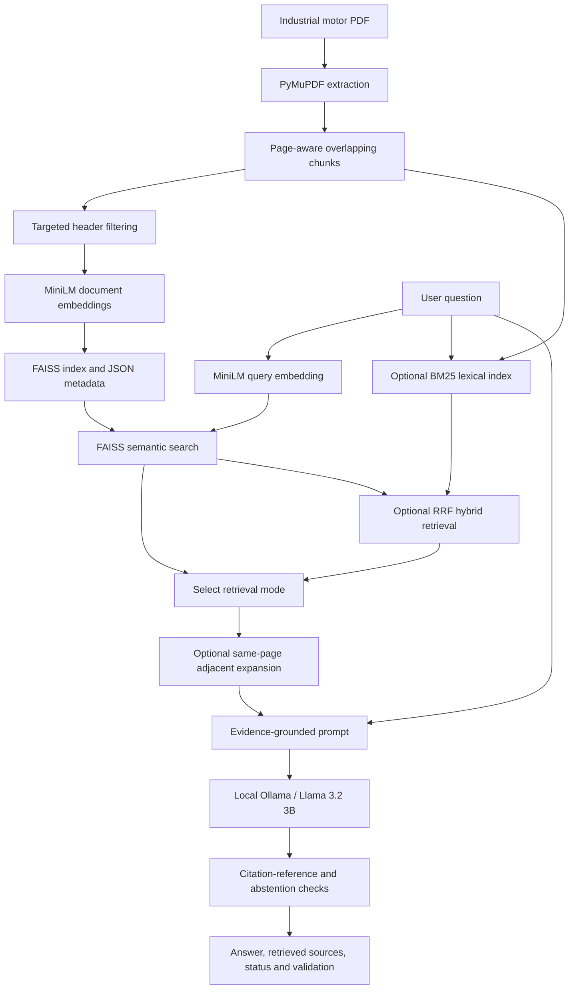

# Industrial Knowledge-Base RAG Assistant

A **local-first Retrieval-Augmented Generation (RAG)** prototype for asking natural-language questions about industrial technical documentation. The application extracts text from a PDF, indexes page-aware passages with Sentence Transformers and FAISS, retrieves supporting evidence, and generates source-cited answers using a local Ollama model. It includes a CLI, FastAPI endpoints, multiple retrieval methods, automated tests, and separate development and held-out evaluations.

**Scope:** An evaluated, single-document portfolio prototype built using a publicly available industrial motor sourcebook. It is not a production-validated technical decision system.

## Highlights

- **Document pipeline:** PyMuPDF extraction, 120-word page-aware chunks with 25-word overlap, source/page/chunk metadata, and targeted removal of standalone header chunks.
- **Retrieval:** Normalized `all-MiniLM-L6-v2` embeddings (384 dimensions) with persistent FAISS `IndexFlatIP`; optional BM25 and FAISS + BM25 hybrid search with reciprocal rank fusion (RRF).
- **Context expansion:** Optionally include neighboring chunks from the **same source and PDF page**. The frozen evaluation configuration starts from FAISS top 5 and expands to at most 10 context passages.
- **Grounded generation:** Local `llama3.2:3b` through Ollama, an evidence-only prompt, explicit insufficient-evidence abstention, and source/page citation-reference checks. An optional OpenAI client exists but is **not used** for the local evaluations.
- **Engineering:** CLI, FastAPI `GET /health` and `POST /ask`, persistent index and metadata, reproducible evaluation scripts, and **101 passing automated tests** in the latest reported local run.

## Results at a glance

The final configuration was selected using the development questions and then evaluated **once on 18 held-out questions** without tuning on those questions. Both datasets concern the **same source PDF**; the held-out set tests unseen questions, not unseen documents.

### Retrieval

| Metric | Development (35 answerable) | Held-out (15 answerable) |
|---|---:|---:|
| FAISS labeled Hit@5 | **33/35 (94.29%)** | **12/15 (80.00%)** |
| FAISS macro labeled Recall@5 | 0.8619 | 0.7667 |
| FAISS MRR@5 | 0.8081 | 0.6556 |
| FAISS + adjacent expansion: labeled evidence in context | **34/35 (97.14%)** | **13/15 (86.67%)** |

*Hit@5* counts questions for which at least one **labeled** supporting passage is among the five original FAISS results. *Expanded evidence coverage* checks the full prompt context after adjacent-chunk expansion (up to 10 passages); **it is not Hit@5**. Labels may omit alternative valid passages. Unanswerable questions are excluded from positive retrieval metrics.

### Answer generation — frozen FAISS + expansion configuration

| Metric | Development (42 questions) | Held-out (18 questions) |
|---|---:|---:|
| Answerable questions receiving an answer | 34/35 | 13/15 |
| Incorrect abstentions on answerable questions | 1/35 | 2/15 |
| Correct abstentions on unanswerable questions | 7/7 | 3/3 |
| Formally valid citation references among generated answers | 29/34 (85.29%) | 8/13 (61.54%) |

A preliminary qualitative review of held-out answers against reference answers and retrieved excerpts identified **8 complete, 4 partial, and 3 incorrect** responses among the 15 answerable questions. These review labels are a first pass, **not independently adjudicated answer-accuracy statistics**. Citation validation checks syntax and whether a cited page was retrieved; it does **not** verify claim-level factual support.

See [`eval/reports/heldout_faiss_expanded_report.md`](eval/reports/heldout_faiss_expanded_report.md) for the held-out protocol, per-question review, observed failures, and reproduction command. Development retrieval comparisons are recorded in [`eval/reports/dev_retrieval_comparison.json`](eval/reports/dev_retrieval_comparison.json).

## Architecture


```mermaid
flowchart TD
    PDF[Industrial motor PDF] --> Extract[PyMuPDF extraction]
    Extract --> Chunk[Page-aware overlapping chunks]
    Chunk --> Filter[Targeted header filtering]
    Filter --> Embed[MiniLM document embeddings]
    Embed --> Store[FAISS index and JSON metadata]

    Question[User question] --> QueryEmbed[MiniLM query embedding]
    QueryEmbed --> Faiss[FAISS semantic search]
    Store --> Faiss
    Chunk --> BM25[Optional BM25 lexical index]
    Question --> BM25
    Faiss --> Select[Select retrieval mode]
    BM25 --> Hybrid[Optional RRF hybrid retrieval]
    Faiss --> Hybrid
    Hybrid --> Select
    Select --> Expand[Optional same-page adjacent expansion]
    Expand --> Prompt[Evidence-grounded prompt]
    Question --> Prompt
    Prompt --> Ollama[Local Ollama / Llama 3.2 3B]
    Ollama --> Check[Citation-reference and abstention checks]
    Check --> Answer[Answer, retrieved sources, status and validation]
```

Index construction is separate from querying. The API lazily loads and caches the saved FAISS index and embedding model on first use of `/ask`. The `/health` endpoint checks API liveness; it does not establish that the index or Ollama is ready.

**Benchmark configuration:** FAISS top 5 + same-page adjacent-chunk expansion (maximum 10 passages), followed by local Ollama generation. BM25 and hybrid retrieval are implemented alternatives but **were not the selected held-out configuration**. The documented held-out metrics come from the batch evaluator with `--retrieval-mode faiss_expanded`; do not assume a default CLI or API request uses identical retrieval settings.

## Tech stack

| Component | Technology |
|---|---|
| Language and API | Python 3.11, FastAPI, Pydantic |
| PDF ingestion | PyMuPDF |
| Embeddings | Sentence Transformers, `all-MiniLM-L6-v2` (384 dimensions) |
| Dense search | FAISS `IndexFlatIP`, L2-normalized vectors |
| Alternative retrieval | BM25, reciprocal rank fusion (hybrid) |
| Local generation | Ollama, `llama3.2:3b` |
| Optional cloud client | OpenAI (not required or used for reported evaluations) |
| Testing | pytest, FastAPI TestClient / HTTPX |

## Quick start — Windows PowerShell

**Prerequisites:** Git, Conda with Python 3.11, and [Ollama for Windows](https://ollama.com/download/windows). Initial dependency and model downloads require internet access. Local question answering does not require OpenAI credits.

### 1. Clone and install

```powershell
git clone https://github.com/CodeByHer0407/industrial-knowledge-rag.git
cd industrial-knowledge-rag
conda create -n industrial-rag python=3.11 -y
conda activate industrial-rag
python -m pip install -r requirements.txt
```

### 2. Obtain the sample sourcebook

This project uses the U.S. Department of Energy's [*Improving Motor and Drive System Performance: A Sourcebook for Industry*](https://www.energy.gov/sites/prod/files/2014/04/f15/amo_motors_sourcebook_web.pdf).

```powershell
New-Item -ItemType Directory -Force data/raw
# Download the linked PDF and save it as data/raw/motor_manual.pdf
```

The raw PDF and generated FAISS index are intentionally excluded from Git. Check the source's terms before redistributing its content.

### 3. Build the index

```powershell
python -m scripts.build_index
```

The documented build generated **528 chunks**, filtered out four standalone header chunks, and saved **524 indexed chunks** to `data/index/index.faiss` with passage metadata in `data/index/metadata.json`. Rebuild the index if the document or preprocessing configuration changes.

### 4. Download and start the local LLM

```powershell
ollama run llama3.2:3b
```

The first run downloads the model. Enter `/bye` to exit the model's chat, and ensure the Ollama service remains running when using this project. On Windows, the Ollama application normally manages the service.

### 5. Ask a question from the CLI

```powershell
# Retrieve passages and preview the prompt without calling the LLM:
python -m scripts.ask "How can motor efficiency be improved?"

# Generate a local answer using Ollama:
python -m scripts.ask "What happens when a motor operates below 40% of full load?" --provider ollama --live

# Show the constructed retrieval-grounded prompt:
python -m scripts.preview_rag_prompt "How can motor efficiency be improved?"
```

The CLI displays retrieved passages, pages, and similarity scores; live mode also displays the generated answer and citation-reference checks. These commands document the existing CLI; the expanded evaluation configuration is invoked explicitly through the batch evaluator below.

### 6. Run the API

```powershell
python -m uvicorn app.main:app --host 127.0.0.1 --port 8000 --reload
```

Open <http://127.0.0.1:8000/docs> for interactive API documentation. Example `POST /ask` request:

```json
{
  "question": "What happens when a motor operates below 40% of full load?",
  "top_k": 5
}
```

The response includes `question`, `answer`, `sources`, `answer_status` (`answered`, `abstained`, or `no_context`), and `citation_validation` (a report or `null` when not applicable). The current `/ask` path uses local Ollama, not OpenAI.

## Evaluation protocol and reproduction

| Dataset | Answerable | Unanswerable | Total | Purpose |
|---|---:|---:|---:|---|
| `eval/questions.json` | 10 legacy technical questions | — | 10 | Historical retrieval baseline |
| `eval/dev_questions.json` | 35 | 7 | 42 | Retrieval development and configuration selection |
| `eval/test_questions.json` | 15 | 3 | 18 | Single final held-out question evaluation |

The 18-question test set was separated from development and its SHA-256 recorded in `eval/test_questions.sha256`. Its digest was checked successfully against that file before final evaluation. The configuration was frozen at **FAISS top 5 + same-page expansion to at most 10 passages + `llama3.2:3b`**. Results were recorded on **27 September 2026**; no retrieval or prompt tuning was performed using these test questions.

### Development retrieval comparisons

The following comparison uses the 35 answerable development questions and the 524-chunk index:

| Retrieval method | Labeled Hit@5 | Macro labeled Recall@5 | MRR@5 |
|---|---:|---:|---:|
| FAISS | 94.29% | 86.19% | 0.8081 |
| BM25 | 85.71% | 80.95% | 0.8000 |
| Hybrid FAISS + BM25 (RRF) | 91.43% | 87.62% | 0.8486 |

FAISS + expansion placed labeled evidence in context for **34/35** questions; hybrid + expansion did so for **33/35**. FAISS + expansion was selected for held-out evaluation based on these development findings. A different method having a higher MRR@5 does not by itself demonstrate better answer generation.

```powershell
# Recompute development retrieval comparisons:
python -m scripts.compare_retrieval_methods

# Reproduce development answer generation (uses local Ollama):
python -m scripts.evaluate_answers_batch --all --retrieval-mode faiss_expanded --top-k 5 --max-context-chunks 10 --output eval/runs/dev_ollama_faiss_expanded_full.json

# Verify held-out dataset integrity:
(Get-FileHash .\eval\test_questions.json -Algorithm SHA256).Hash -eq (Get-Content .\eval\test_questions.sha256).Trim()

# Run automated tests:
python -m pytest -q
```

The original **held-out** generation used the following command **once, after freezing the configuration**. The saved output is a record of that run; new runs may yield different LLM outputs and should use a separate filename rather than overwriting it.

```powershell
python -m scripts.evaluate_answers_batch --dataset test --all --confirm-heldout --retrieval-mode faiss_expanded --top-k 5 --max-context-chunks 10 --output eval/runs/test_ollama_faiss_expanded_full.json
```

### Historical 10-question baseline

| Metric | Original index (528 chunks) | Filtered index (524 chunks) |
|---|---:|---:|
| Hit Rate@5 | 1.000 | 1.000 |
| Labeled Recall@5 | 0.850 | 0.850 |
| MRR@5 | 0.750 | 0.775 |

The historical sample is small and was used during development; it is **not** the held-out benchmark. Separately, the original **FAISS-only** generation baseline on 35 answerable development questions received preliminary review labels of **16 complete, 17 partial, and 2 incorrect abstentions**; 7/7 unanswerable questions were correctly abstained on. These historical answer-review counts must not be attributed to the later FAISS + expansion run.

## Automated tests

```powershell
python -m pytest -q
```

**Latest reported local run (27 September 2026): 101 passed, 1 third-party Starlette/AnyIO deprecation warning.** Tests cover ingestion and preprocessing, search and retrieval alternatives, adjacent expansion, persistence, dataset validation, citation-reference checks, RAG orchestration, CLI, and API. Mocked and synthetic tests validate code behavior; they do not prove generated-answer correctness or deployment readiness.

## Repository layout

```text
app/          PDF ingestion, chunking, embeddings, FAISS, BM25,
              hybrid retrieval, adjacent expansion, prompting,
              LLM clients, citation validation, API
scripts/      Index building, CLI, prompt previews, retrieval comparison,
              batch answer generation and evaluation tools
tests/        Unit, evaluation-schema, retrieval, pipeline, CLI and API tests
eval/         Legacy, development and held-out question sets;
              evaluation reports and optional local run outputs
data/raw/     Local source PDFs (ignored by Git)
data/index/   Generated FAISS index and metadata (ignored by Git)
```

## Limitations and future work

- **Single-document, text-based prototype.** No general multi-document ingestion or OCR for scanned PDFs; both evaluation sets use the same sourcebook.
- **Retrieval is imperfect.** The frozen held-out run missed labeled evidence for Q049 and Q050 even after expansion. In Q043, the labeled chunk was missed by FAISS top five, but a different retrieved passage on page 20 contained equivalent relevant facts. Strict label-based metrics may undercount valid alternative evidence.
- **PDF structure is imperfect.** Fixed-size chunk boundaries, text extraction artifacts, tables of contents, and flattened tables can introduce low-signal or misleading context.
- **Generation and citation reliability require improvement.** The held-out run incorrectly abstained on Q049/Q050; Q045 confused motor voltage and enclosure selection despite having the relevant passage. Five of 13 held-out generated answers had missing or malformed citation references. A valid cited page is **not** proof that every claim is supported.
- **Operational scope is limited.** Abstention recognition currently relies on an exact insufficient-evidence response, `/health` is a liveness check rather than a dependency-readiness check, and local generation speed depends on available hardware. There is no calibrated out-of-domain threshold or production safety validation.
- **Potential future enhancements:** Generalized TOC filtering, structure-aware PDF table parsing, reranking, claim-level citation verification, multi-document ingestion, OCR, containerization, stronger reproducibility checks and a frontend. These are **not** part of the reported held-out configuration.

## Data, privacy and attribution

The sample sourcebook is attributed and linked in the setup section. Source PDFs, local FAISS artifacts, virtual environments and `.env` files are excluded from version control. Do not commit proprietary manuals, credentials or personal data. The documented Ollama path performs model inference locally after initial downloads.

## Status

**Portfolio-ready single-document RAG prototype; frozen development and held-out evaluation completed (September 2026).** The project demonstrates PDF ingestion, dense/lexical/hybrid retrieval, adjacent-context expansion, local grounded generation, an API, structured evaluation and automated tests. Its measured limitations are documented rather than described as production-ready accuracy.
